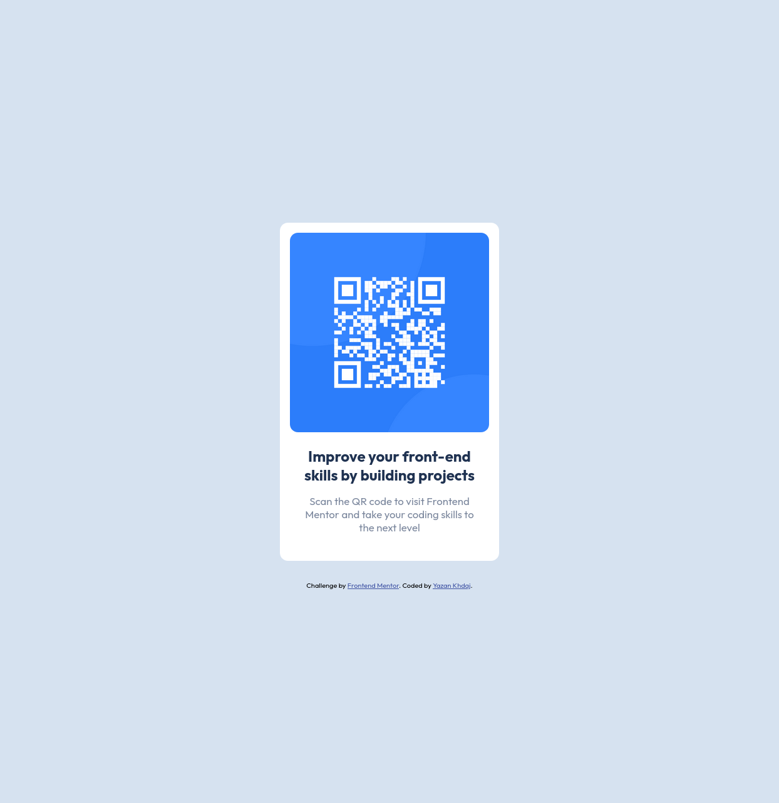

# Frontend Mentor - QR code component solution

This is a solution to the [QR code component challenge on Frontend Mentor](https://www.frontendmentor.io/challenges/qr-code-component-iux_sIO_H). Frontend Mentor challenges help you improve your coding skills by building realistic projects. 

## Table of contents

- [Overview](#overview)
  - [Screenshot](#screenshot)
  - [Links](#links)
- [My process](#my-process)
  - [Built with](#built-with)
  - [Continued development](#continued-development)
- [Author](#author)

## Overview

### Screenshot

#### Desktop Design:

#### Mobile Design

### Links

- Live Site URL: [Add live site URL here](https://your-live-site-url.com)

## My process

### Built with

- Semantic HTML5 markup
- CSS custom properties
- Flexbox
- CSS Grid
- Mobile-first workflow

## Author

- Website - [Yazan Khdaj](https://yazan.rf.gd)
- Frontend Mentor - [@Yazan-Khdaj](https://www.frontendmentor.io/profile/Yazan-Khdaj)
- Linkedin - [@yazan-khdaj](https://www.linkedin.com/in/yazan-khdaj-24b9a7266)
- Codepen.io - [@yazan-khdaj](https://codepen.io/yazan-khdaj)
- Facebook - [Yazan Kh (YK)](https://www.facebook.com/profile.php?id=100090310123746)
